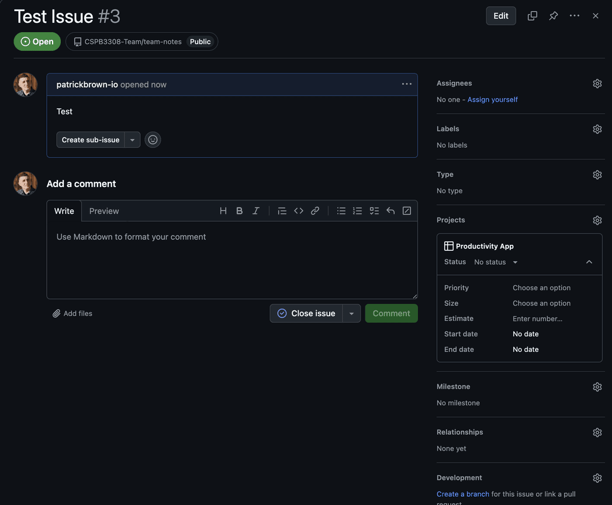
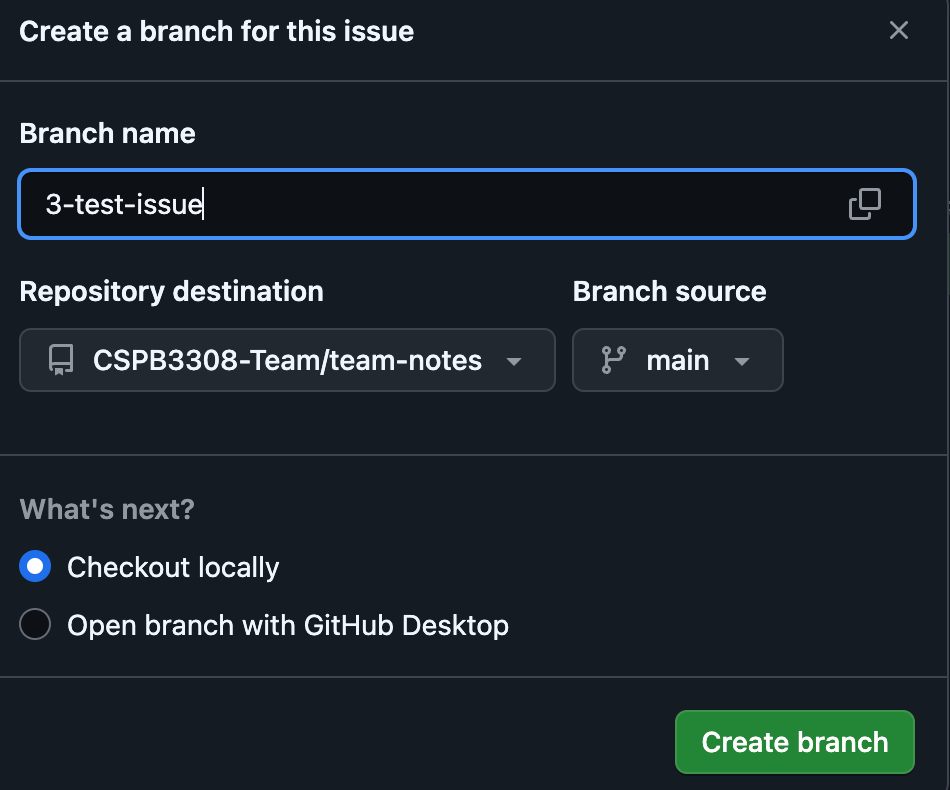
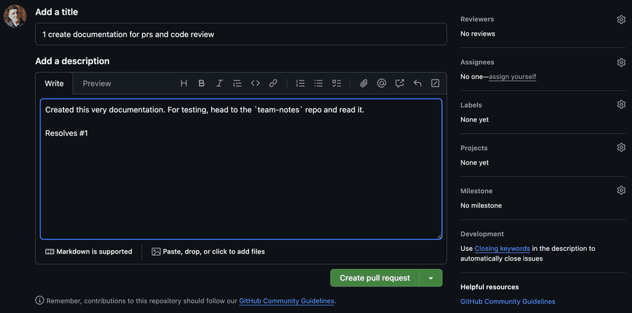

# How to Contribute

This document will outline steps on how to contribute to the code -- creating issues, assigning them, creating branches, opening Pull Requests (signals the code is ready to be tested, reviewed and merged into `main`)

## Creating Issues
You can create issues from the [Project Board](https://github.com/orgs/CSPB3308-Team/projects/1) or on Individual Repositories. On the Project Board, scroll the bottom of any column, and create...

**IMPORTANT: Make sure it's assigned to the correct repo! If you hit the `#` key when you start typing, you can select a repo to attribute it to (front-end, back-end, documentation, etc) and then fill out the details.**

I typically like to keep titles short and add the details in the Description, to make the automatic branch names easy (will get into below)

Once you have your issue created, you'll be left with something like this:

Now you fill out the important stuff!

### Issue Details
There's some nice-to-have stuff here, like labels but the important stuff to do here:
- `Assign` a team member or yourself
- Under `Projects`, set a Status. Ready indicates that this is Ready for Pickup.
- When you're ready to work on this issue, `Create a Branch` to automatically link the ticket to the code branch you'll be working on, which will pop this up below:

Here all you have to do is confirm the repo is correct, and the source is correct (usually main, unless you're blocked by an in-progress ticket that will soon be merged in) and create the branch!

## Code the Feature!
Go to the repo on your local machine and run `git fetch -a`, to grab any changes. You should see your new branch appear in the process running. When that finishes you can run `git checkout <branch-name>` so in this example I would run `git checkout 3-test-issue` to pivot to that new branch. This is why I keep issue titles short, otherwise you'll generate something like `3-adding-a-navbar-to-the-front-page-of-the-frontend`. But if that worked and you're working off your new branch, then you're ready to build out that feature!

### Checking `main` often avoids MERGE CONFLICTS
Occasionally after pushing some code, or if you know that someone elses ticket just got merged in, go ahead and pivot off your branch temporarily via `git checkout main` and `git fetch -a` to check for the new changes. If there's something new on remote main, `git pull` those onto your local `main` and you'll be up to date locally. 

 Then `git checkout` to your in-progress branch and run `git merge main` -- which will pull in the approved new changes. There may be merge conflicts. BUT its better to hit these early and small instead of after your feature is built out and have to deal with a mess! So check often! 

## Pull Requests (PRs)
Once you're done building and have pushed your code up, head to Github and the repo you're working on. You should see this cool green button `Compare & Pull Request` if you've pushed fairly recently:

If you DON'T see it, head on the Github.com repo and change the branch you're looking at-- 

And that green button we're looking for should be there instead! It will go away if you don't `Compare & Pull Request` shortly (like an hour?) after a push, but if its hiding, then that's where it'll be instead. This button will show up everytime you push, but if your feature isn't ready yet then you aren't required nor encouraged to open a PR immediately. Just wait till its done, or you need extra eyes which we'll get into below.

Fill out a title, usually something descriptive like `Added Navbar Component` or `Built out User Routes`. Under the description you can go into greater detail -- add testing notes for how to test your feature, run tests, etc. 

It should be automatically linked if you followed the workflow, but you can add `Resolves #<whatevernumber>` to the PR description and it will automatically link to the issue. Here's some documentaiton on keywords:

https://docs.github.com/en/issues/tracking-your-work-with-issues/using-issues/linking-a-pull-request-to-an-issue

## Request a Review or Open a Draft
The important stuff on here is under `Reviewers` you can tag a team member to request a code review.

I believe it will automatically fill out the `Projects` portion if you followed this workflow, but if not, you can add it to the Project board there too under review. 

From here you can either `Create a Pull Request` which is an offical request for review in order to merge your code into main, OR if you click the down icon next to that, `Create a Draft Pull Request`, is useful if you want to open something up for a second pair of eyes and critique/comment before its ready for the prime time. 

## Reviewing Others Coce
So you've been tagged to review some code! To do this, you can check the ticket for the branch you're reviewing in the PR or you can head to the linked issue

Once you know the branch name and review the PR description, get to testing! Head to your local repo and `git fetch -a`. This should grab any changes that have been pushed to the remote repo on Github, including what you're going to test. 

If you're not sure what branch, or if it pulled down, you can run `git branch -a` for a list, followed by `:q` to leave the VIM menu. 

You can `git checkout` to the branch! This will pull all the new code to your local machine. `Git Pull` if you've tested already but changes were made. 

## Testing
Make sure the code works. Test what the issue was and make sure everything behaves as expected. Make sure files added are in the right place. Do your best to find the hapy accidents. Talk to whoever made the PR if you have any questions or walk through it together. Now is the time to prevent bugs! When it looks good, or if you have feedback, you can do both in the PR. You can `Request Changes` and comment what you'd specifically change, or you can `Approve` it. 

## Merging
Did you test and everything looks good? Great, its ready to merge! Go ahead and click `Merge Pull Request` and it will be merged to main. An option will pop up below to delete the branch, which you should do to keep the `git branch -a` tidy, but make sure the person who's PR you're reviewing doesn't need it. 

Once you `Merge Pull Request`, the feature created on the branch will be shoved into `main`! All done! If the ticket wasn't closed out, you can go head and move it to done in the project board but the workflow should do that automagically. 

## The New Main
Your change has been added to `main`. Go ahead and `git fetch -a` to check for the changes locally and `git pull` if there are while checked out on `main`. Now grab another ticket!